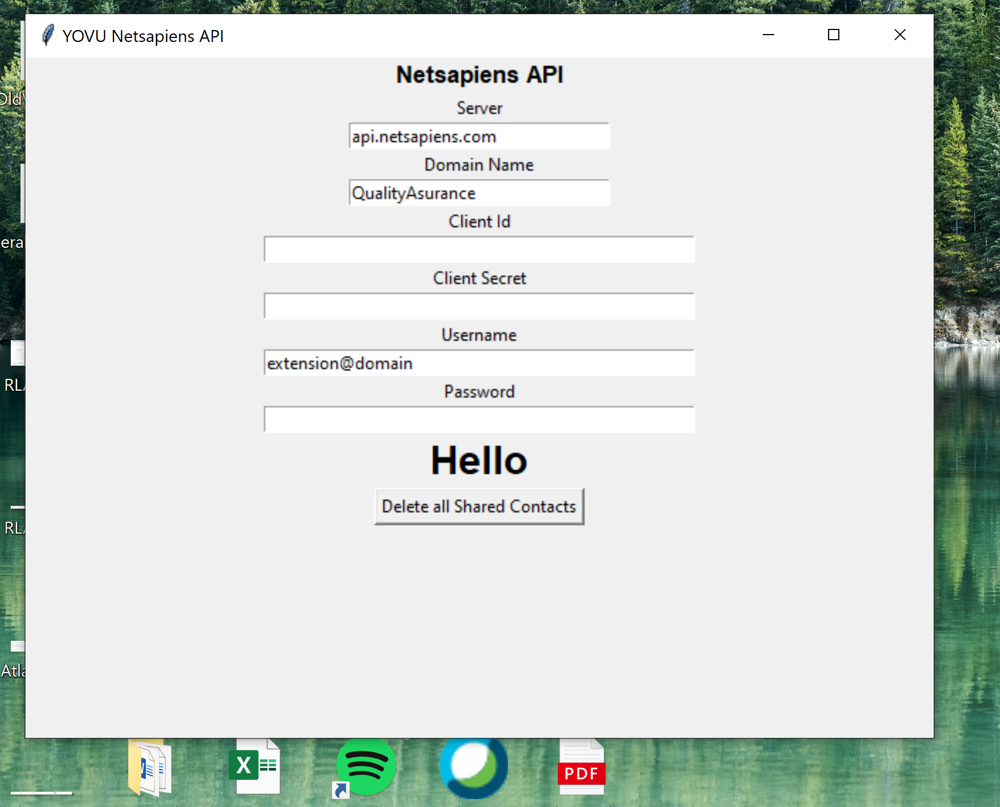

# Scripts using Netsapiens API
Developed by [YOVU Office Phone](https://yovu.ca)
## 1. Delete all Shared Contacts
```source/delete-shared-contact/DeleteSharedContact.py```


[Netsapiens API Documentation - Delete a Contact](https://api.netsapiens.com/ns-api/webroot/apidoc/#api-Contact-Delete)

You can delete all shared contacts using this script. You may repurpose the script to loop through your own list of contact ids and delete them from the server.

>__Warning__: 
Make sure you know what you are doing before proceeding. Backup if needed. We are not responsible for any changes you make to your system using this script.
### __Files__
You must add your credentails in ```Settings.ini``` for the script to work.These details are used for Authentication
1. Server Name. example: api.netsapiens.com ; Please do not include http// or https://
1. API Client Id : Client Id of your app that you created in Netsapiens.
1. Client Secret : Client Secret corresponding to the client id above.
1. Domain : Domain Name from which you want to delete the shared contacts.
1. User Name : Your login username for the server.
1. Password :  Your password you use to login.

If you like you can also hardcode the credentials within the py script and run the script.

__After Execution of the script:__ 

Logs can be found in : ```NSLog.log```  
```Success.csv``` will hold the list of shared contacts that were successfully deleted.  
```Fail.csv``` will hold the list of shared contacts that were not deleted.
### GUI Version

We have included a GUI version of the same script. ```source/delete-shared-contact/DeleteShareContactUI.py```
You can modify the GUI version to meet your purpose. 


## 2. Read All Device/Subscriber within a Domain
```source/read-all-devices-domain/ReadAllDevices.py```


[Netsapiens API Documentation - Devices Read](https://api.netsapiens.com/ns-api/webroot/apidoc/#api-Device-Read)
1. You can use this script to fetch all devices within a domain. I have added only eight fields for download. You can alter the ```class Device``` to add more as per your need.
1. You can edit line ```108 : read_all_devices('domainName')``` to run the script for different domain.
1. You need to have atleast *Reseller* permission to read all devices within the domain. Please refer netsapiens documentation for fields,parameters and response.


After successfully running the script:
```ListOfSubscribers.csv``` will hold the details of all the devices within that domain.


*__Technical Details__:
There is a 5 second delay after every 25th delete request in case you are deleting a lot of request. But it is recommended to batchify the code if required.* 


